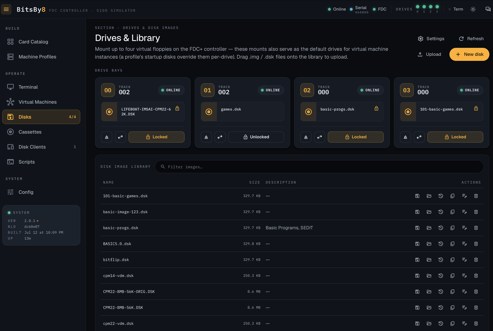

# FDC+ Serial Drive Server


A TypeScript Serial Disk Server for the **FDC+ Enhanced Floppy Disk Controller** on the **MITS Altair 8800**. Serves virtual floppies, cassette audio, and a VT102 terminal over serial, with a Svelte 5 web UI for control.

**Version:** 2.0.0 · **License:** GPL-3.0



---

## Quickstart

```bash
# Clone, install both trees, run backend + frontend dev servers
git clone <repo-url> fdcplus-web && cd fdcplus-web
pnpm install                       # pnpm workspace: provisions root + frontend/
pnpm dev:all                       # backend (ts-node) + Vite dev concurrently
open http://localhost:3000         # mount a sample disk image; no hardware needed
```

For a connected Altair (Pi target), see [Installation](#installation) and the GPIO sections below.

## Supported platforms

| Platform | Status | Notes |
|---|---|---|
| Linux (Raspberry Pi & x86) | ✅ Tested | Primary production target; GPIO LED support |
| macOS | ✅ Tested | Dev / exploration; serial works via `/dev/cu.usbserial-*` |
| Windows | ⚠️ Untested | Should work in theory (Node.js + SerialPort), but no contributor runs it. PRs welcome. |
| Docker | ✅ | `docker-compose.yml` included |

## Contributing & architecture

- [`CONTRIBUTING.md`](CONTRIBUTING.md) — how to send a PR, what the pre-PR gate runs
- [`AGENTS.md`](AGENTS.md) — terse repo conventions (filename casing, scripts, testing rules)
- [`_bmad-output/project-context.md`](_bmad-output/project-context.md) (gitignored) — AI-agent context with the load-bearing details: tokens, primitives, stack traps, vintage-hardware invariants

---

## Overview

A TypeScript implementation of an FDC+ Serial Disk Server. It speaks the FDC+ wire protocol over serial so it works with the existing FDC+ Enhanced Floppy Disk Controller hardware on an unmodified Altair 8800. Features:

- Modern async/await architecture with modular Express backend
- Type-safe protocol implementation
- Structured logging (pino) with verbose / debug modes
- Cross-platform support (Linux + macOS tested; Windows untested)
- **Svelte 5 + Tailwind 4 web interface** with real-time Socket.IO status updates
- **VT102 terminal emulator** for a second serial port (with optional CRT phosphor mode)
- **MCP server** with 30 tools for AI assistant integration — see [AI Assistant Integration](#ai-assistant-integration-mcp)
- **GPIO LED status indicators** for Raspberry Pi
- **OpenAPI/Swagger documentation** at `/api/docs` (also committed as [`openapi.json`](openapi.json))
- SQLite database with WAL mode for persistent state
- Docker and Debian package deployment support

---

## Architecture

The codebase is organized into a modular backend and a Svelte single-page application frontend:

```
src/
├── index.ts              # Entry point with CLI parsing
├── server.ts             # Main server loop & command processing
├── drive.ts              # Drive management & disk I/O
├── serial.ts             # FDC+ serial port communication
├── terminal-serial.ts    # Terminal serial port manager
├── web-server.ts         # Express orchestrator (composes modules below)
├── protocol.ts           # FDC+ protocol definitions & types
├── config.ts             # Configuration file loading & validation
├── database.ts           # SQLite database management
├── mcp-server.ts         # MCP server (30 AI-accessible tools)
├── openapi-def.ts        # OpenAPI/Swagger specification
├── types.ts              # Shared TypeScript types
├── routes/               # Express route handlers
│   ├── cassettes.ts      # Cassette tape management
│   ├── config.ts         # Runtime configuration
│   ├── cpm.ts            # CP/M filesystem utilities
│   ├── disk-serving.ts   # Disk image serving control
│   ├── drives.ts         # Drive mount/unmount/status
│   ├── health.ts         # Health check endpoints
│   ├── images.ts         # Disk image library
│   ├── replay.ts         # Script replay & XMODEM transfers
│   ├── scripts.ts        # Script management
│   ├── serial.ts         # Serial port management
│   └── terminal.ts       # Terminal serial management
├── services/             # Business logic
│   ├── audio.ts          # Audio/cassette processing
│   ├── disk-serving.ts   # Disk serving logic
│   ├── file-listing.ts   # File/directory listing
│   ├── status.ts         # Status broadcasting
│   └── transfer.ts       # File transfer logic
├── middleware/            # Express middleware
│   ├── auth.ts           # API key authentication
│   ├── security.ts       # CORS, CSP, rate limiting
│   └── static.ts         # Static file serving & Swagger UI
├── websocket/
│   └── handlers.ts       # Socket.IO event handlers
├── utils/
│   └── safe-path.ts      # Path traversal prevention
└── gpio/                 # GPIO LED status indicators
    ├── gpio-manager.ts
    └── gpio-controller.ts

frontend/                  # Svelte 5 + Vite + Tailwind 4 SPA
├── src/
│   ├── App.svelte         # Root application component
│   ├── lib/
│   │   ├── components/    # Reusable UI components
│   │   │   ├── chat/      # AI assistant panel
│   │   │   └── shared/    # StatusLed, LedPanel, Toast
│   │   ├── pages/         # Page components (Terminal, Disks, Cassettes, Scripts, Config)
│   │   ├── services/      # API client & Socket.IO
│   │   ├── stores/        # Svelte stores (state management)
│   │   └── types/         # TypeScript type definitions
│   └── main.ts
└── vite.config.ts
```

### Key Modules

- **server.ts / protocol.ts**: FDC+ command processing (STAT, READ, WRIT) and protocol definitions
- **drive.ts**: Async disk image I/O using Node.js fs/promises
- **serial.ts / terminal-serial.ts**: Serial port communication for FDC+ controller and VT102 terminal
- **web-server.ts**: Express orchestrator that composes route, service, and middleware modules
- **routes/**: 11 Express route modules covering drives, images, cassettes, scripts, terminal, etc.
- **services/**: Business logic separated from HTTP handling (status, transfers, audio, file listing)
- **middleware/**: Security (Helmet, CORS, rate limiting), API key auth, and static file serving
- **mcp-server.ts**: MCP server exposing 30 tools for AI assistant integration via stdio transport (see [AI Assistant Integration](#ai-assistant-integration-mcp))
- **frontend/**: Modern Svelte 5 SPA with real-time Socket.IO updates, xterm.js terminal, and retro CRT mode

---

## Installation

### Option 1: Debian Package (Recommended for Raspberry Pi/Raspbian)

The easiest way to install on Raspberry Pi or Debian-based systems is using the Debian package:

```bash
# Build the package
make deb

# Install the package
sudo dpkg -i ../fdcsds_2.0.0-1_all.deb
sudo apt-get install -f

# Configure
sudo nano /etc/fdcsds/fdcsds.config.json

# Start the service
sudo systemctl start fdcsds
sudo systemctl enable fdcsds
```

See [DEBIAN-PACKAGE.md](DEBIAN-PACKAGE.md) for complete Debian package documentation.

### Option 2: From Source

#### Prerequisites

- **Node.js** 22+
- **npm** or **yarn**
- Serial port access permissions

#### Install Dependencies

```bash
npm install
```

**Note for macOS/Windows developers:** If `npm install` fails due to the optional `onoff` GPIO package, use:
```bash
npm install --no-optional
```

This will install:
- `serialport` - Serial port communication
- `commander` - CLI argument parsing
- `express` - Web server framework
- `socket.io` - WebSocket communication
- `cors` - Cross-origin resource sharing
- `onoff` - GPIO control for Raspberry Pi (optional, Linux only)
- `typescript` - TypeScript compiler

### Build

```bash
npm run build
```

This compiles the TypeScript source to JavaScript in the `dist/` directory.

### Global Installation (Optional)

```bash
npm install -g .
```

This installs `fdcsds` as a global command.

---

## Usage

### Basic Usage

```bash
# Development mode (ts-node)
npm run dev -- -p /dev/ttyUSB0 -0 disks/cpm22.dsk

# Production mode (compiled)
npm start -- -p /dev/ttyUSB0 -0 disks/cpm22.dsk

# Or if installed globally
fdcsds -p /dev/ttyUSB0 -0 disks/cpm22.dsk
```

### Configuration File

The server supports configuration files to simplify startup and avoid long command lines.

#### Default Locations

The server automatically searches for config files in these locations (in order):
1. `.fdcsds.config`
2. `.config/fdcsds.json`
3. `fdcsds.config.json`

#### Creating a Configuration File

Generate an example configuration file:
```bash
fdcsds --example-config > .fdcsds.config
```

Or copy the example:
```bash
cp .fdcsds.config.example .fdcsds.config
```

#### Configuration File Format

The configuration file uses JSON format:

```json
{
  "port": "/dev/ttyUSB0",
  "baud": 230400,
  "drive0": "disks/cpm22.dsk",
  "drive1": "disks/games.dsk",
  "drive2": null,
  "drive3": null,
  "readonly": [0],
  "verbose": false,
  "debug": false,
  "logFile": null,
  "web": true,
  "webPort": 3000,
  "webHost": "localhost",
  "terminalPort": "/dev/ttyUSB1",
  "terminalBaud": 9600,
  "terminalAutoconnect": false,
  "gpioLeds": {
    "enabled": false
  }
}
```

#### Using a Configuration File

**With default location:**
```bash
# Create config file
fdcsds --example-config > .fdcsds.config
# Edit it, then simply run:
fdcsds
```

**With custom location:**
```bash
fdcsds --config /path/to/myconfig.json
# or
fdcsds -c myconfig.json
```

**Override config with CLI arguments:**
```bash
# Use config file but override port
fdcsds -c production.config -p /dev/ttyUSB1
```

**Note:** Command-line arguments always take precedence over config file settings.

---

### Command-Line Options

```
Usage: fdcsds [options] -p <port>

Options:
  -p, --port <device>       Serial port for FDC+ (required if not in config)
  -b, --baud <rate>         Set FDC+ serial port speed (default: 230400)
  -0, --drive0 <file>       Mount disk image to drive 0
  -1, --drive1 <file>       Mount disk image to drive 1
  -2, --drive2 <file>       Mount disk image to drive 2
  -3, --drive3 <file>       Mount disk image to drive 3
  -r, --readonly <n>        Make drive 0-3 read only
  -v, --verbose             Verbose display
  -d, --debug               Debug mode
  --log-file <path>         Log file path (enables file-based logging)
  -w, --web                 Enable web interface (default: disabled)
  --web-port <port>         Web interface port (default: 3000)
  --web-host <host>         Web interface host (default: localhost)
  --terminal-port <device>  Second serial port for terminal emulation
  --terminal-baud <rate>    Terminal port baud rate (default: 9600)
  --terminal-autoconnect    Auto-connect terminal port on startup
  --gpio-leds               Enable GPIO LED status indicators (Raspberry Pi)
  --no-gpio-leds            Disable GPIO LED status indicators
  --gpio-active-low         Use active-low logic for LEDs
  -c, --config <file>       Configuration file path
  --example-config          Print example configuration file and exit
  -h, --help                Display help information
```

### Supported Baud Rates

- 9600
- 19200
- 38400
- 57600
- 76800
- 230400 (default)
- 403200 (macOS only)
- 460800

### Examples

**Mount multiple drives:**
```bash
fdcsds -p /dev/ttyUSB0 \
  -0 disks/cpm22.dsk \
  -1 disks/altdos.dsk \
  -2 disks/basic.dsk
```

**Read-only drive:**
```bash
fdcsds -p /dev/ttyUSB0 -0 disks/cpm22.dsk -r 0
```

**Custom baud rate:**
```bash
fdcsds -p /dev/ttyUSB0 -b 460800 -0 disks/cpm22.dsk
```

**Verbose mode:**
```bash
fdcsds -p /dev/ttyUSB0 -v -0 disks/cpm22.dsk
```

**Enable web interface:**
```bash
fdcsds -p /dev/ttyUSB0 -0 disks/cpm22.dsk -w
# Access at http://localhost:3000
```

**Custom web interface host and port:**
```bash
fdcsds -p /dev/ttyUSB0 -0 disks/cpm22.dsk -w --web-port 8080 --web-host 0.0.0.0
# Access at http://0.0.0.0:8080
```

**Two serial ports (FDC+ and Terminal):**
```bash
fdcsds -p /dev/ttyUSB0 -0 disks/cpm22.dsk \
  --terminal-port /dev/ttyUSB1 --terminal-baud 9600 -w
# Terminal accessible via web interface
```

**Auto-connect terminal on startup:**
```bash
fdcsds -p /dev/ttyUSB0 -0 disks/cpm22.dsk \
  --terminal-port /dev/ttyUSB1 --terminal-autoconnect -w
```

**Using configuration file:**
```bash
# Generate and edit config file
fdcsds --example-config > .fdcsds.config
nano .fdcsds.config

# Run with config (no other args needed!)
fdcsds

# Or use custom config location
fdcsds --config production.config
```

**With GPIO LED status indicators (Raspberry Pi):**
```bash
# Enable GPIO LEDs with default pin mapping
fdcsds -p /dev/ttyUSB0 -0 disks/cpm22.dsk --gpio-leds -w

# GPIO LEDs show real-time status for all drives and terminal
# See GPIO-LEDS.md for wiring and configuration details
```

---

## Web Interface

The server includes an optional web interface for remote monitoring and control.

### Features

- **Real-time Status Updates**: Live drive status via WebSocket
- **Drive Management**: Mount/unmount disk images remotely
- **VT102 Terminal Emulator**: Interactive serial console in browser
- **Multiple Serial Ports**: Separate FDC+ and terminal connections
- **REST API**: Full HTTP API for automation

### Enabling Web Interface

Start the server with the `-w` flag:

```bash
fdcsds -p /dev/ttyUSB0 -0 disks/cpm22.dsk -w
```

Then open your browser to: **http://localhost:3000**

### Web Interface Sections

#### 1. Drive Management
- View mounted drives and their status
- Mount/unmount disk images via dropdown menus
- Toggle read-only protection
- Real-time track position and head load status

#### 2. VT102 Terminal Emulator
- Full xterm.js-based terminal emulator
- Configurable serial port settings:
  - Baud rate: 9600 - 115200
  - Data bits: 5, 6, 7, 8
  - Stop bits: 1, 2
  - Parity: None, Even, Odd, Mark, Space
  - Flow control: None, Hardware, Software
- Serial port selection from available devices
- Connect/disconnect controls
- Clear screen function
- Full VT102 escape sequence support

### REST API Endpoints

#### Drive Management
```
GET    /api/status              Get complete server status
GET    /api/drives              Get all drive statuses
GET    /api/images              List available disk images
POST   /api/drives/:id/mount    Mount disk image
POST   /api/drives/:id/unmount  Unmount drive
PUT    /api/drives/:id/readonly Set write protection
```

#### Terminal Management
```
GET    /api/terminal/status     Get terminal connection status
GET    /api/terminal/ports      List available serial ports
POST   /api/terminal/open       Open terminal serial port
POST   /api/terminal/close      Close terminal serial port
PUT    /api/terminal/config     Update terminal configuration
```

#### Example API Usage
```bash
# Get server status
curl http://localhost:3000/api/status

# Mount disk image
curl -X POST http://localhost:3000/api/drives/0/mount \
  -H "Content-Type: application/json" \
  -d '{"filename":"cpm22.dsk"}'

# List available serial ports
curl http://localhost:3000/api/terminal/ports

# Open terminal port
curl -X POST http://localhost:3000/api/terminal/open \
  -H "Content-Type: application/json" \
  -d '{"device":"/dev/ttyUSB1","config":{"baudRate":9600}}'
```

### WebSocket Events

The web interface uses Socket.IO for real-time updates.

#### Drive Events
```javascript
// Server → Client
'status' - Drive and serial status update

// Client → Server
'request-status' - Request immediate status update
```

#### Terminal Events
```javascript
// Server → Client
'terminal:data'   - Raw serial data from device
'terminal:status' - Terminal connection status
'terminal:error'  - Terminal error messages

// Client → Server
'terminal:write'   - Send data to serial device
'terminal:control' - Control signals (DTR, RTS)
```

---

## AI Assistant Integration (MCP)

The server ships a [Model Context Protocol](https://modelcontextprotocol.io/) server that exposes **30 tools** to MCP-compatible assistants (Claude Desktop, Claude Code, etc.). It runs over **stdio transport** as a separate process from the web server (`fdcsds --mcp ...`).

### Tool surface (30 tools, by category)

| Category | Capabilities (examples) |
|---|---|
| **Status** | `get_status`, `get_drive_status` |
| **Drives** | `list_drives`, `mount_disk`, `unmount_disk`, `set_drive_readonly` |
| **Disk images** | `list_disk_images`, `create_disk_image`, `clone_disk_image`, `delete_disk_image`, `upload_disk_image` |
| **CP/M filesystem** | `list_cpm_files`, `read_cpm_file`, `write_cpm_file`, `delete_cpm_file`, `format_cpm_disk` |
| **Terminal serial** | `list_terminal_ports`, `open_terminal`, `close_terminal`, `send_to_terminal` |
| **Replay / transfer** | `start_replay`, `cancel_replay`, `list_scripts` |
| **Cassettes** | `list_cassettes`, `play_cassette`, `stop_cassette` |
| **Configuration** | `configure_serial`, `enable_disk_serving`, `disable_disk_serving` |

The exact, current list is the source of truth in [`src/mcp-server.ts`](src/mcp-server.ts).

### Auth, transport, and default posture

- **Transport:** stdio (one process per assistant session).
- **Auth:** none on stdio (parent process trust model). The MCP server runs only when launched explicitly with `--mcp`.
- **Default posture:** **disabled** — the regular `fdcsds` binary does NOT start MCP. You opt in per-session.
- **Blast radius if exposed:** the tools can read and **write** disk images, mount/unmount drives, send arbitrary bytes to the serial port, and read/write CP/M files on mounted disks. Do not point an assistant at production hardware without intent.

### Enabling it (Claude Desktop / Claude Code)

```json
{
  "mcpServers": {
    "fdcplus": {
      "command": "fdcsds",
      "args": ["--mcp", "--data-dir", "/path/to/your/data"]
    }
  }
}
```

The web interface's Chat panel (top-bar `forum` icon) has the same config block with a copy button.

---

## VT102 Terminal Emulator

### Overview

The web interface includes a fully-functional VT102 terminal emulator powered by xterm.js. This allows you to connect to a second serial port (separate from the FDC+ port) for interactive terminal sessions.

### Use Cases

- **CP/M Console**: Connect to CP/M system console
- **Debugging**: Monitor system output
- **Interactive Sessions**: Run programs interactively
- **System Administration**: Configure devices via serial console

### Configuration

The terminal supports standard serial port configurations:

| Setting | Options | Default |
|---------|---------|---------|
| Baud Rate | 9600, 19200, 38400, 57600, 115200 | 9600 |
| Data Bits | 5, 6, 7, 8 | 8 |
| Stop Bits | 1, 2 | 1 |
| Parity | None, Even, Odd, Mark, Space | None |
| Flow Control | None, Hardware (RTS/CTS), Software (XON/XOFF) | None |

### Terminal Features

- **VT102 Compatibility**: Full escape sequence support
- **Color Support**: ANSI color codes
- **Cursor Control**: Blinking cursor with position tracking
- **Resizable**: Responsive terminal that fits browser window
- **Copy/Paste**: Standard copy/paste support
- **Scrollback**: Terminal history buffer
- **Keyboard**: Full keyboard support including function keys

### Hardware Setup

Connect two serial ports:
1. **Primary Port** (`-p /dev/ttyUSB0`): FDC+ disk controller
2. **Terminal Port** (`--terminal-port /dev/ttyUSB1`): System console

Example connection diagram:
```
Computer (fdcsds)          Altair 8800
-----------------          -----------
/dev/ttyUSB0  ←─────────→  FDC+ Port (Disk I/O)
/dev/ttyUSB1  ←─────────→  Console Port (Terminal)
```

### Usage Example

```bash
# Start server with both ports
fdcsds -p /dev/ttyUSB0 \
  -0 disks/cpm22.dsk \
  --terminal-port /dev/ttyUSB1 \
  --terminal-baud 9600 \
  --terminal-autoconnect \
  -w

# Access web interface
open http://localhost:3000
```

Then in the browser:
1. Navigate to the Terminal section
2. Select serial port from dropdown
3. Configure baud rate and other settings
4. Click "Connect"
5. Start typing to interact with the serial device

---

## GPIO LED Status Indicators

### Overview

The server supports optional GPIO LED status indicators for Raspberry Pi and compatible Linux systems. This provides real-time visual feedback for drive and terminal activity without needing to access the web interface.

### Features

- **15 LEDs Total**:
  - 12 Drive LEDs (3 per drive × 4 drives): Enable, Head Load, Read Only
  - 3 Terminal LEDs: RX, TX, Connected
- **Configurable pin mapping** via configuration file
- **Graceful fallback** on non-Raspberry Pi platforms
- **No special wiring required** - standard LED + resistor

### Quick Start

```bash
# Enable GPIO LEDs with default pin mapping
fdcsds -p /dev/ttyUSB0 -0 disks/cpm22.dsk --gpio-leds
```

Or add to your configuration file:

```json
{
  "port": "/dev/ttyUSB0",
  "gpioLeds": {
    "enabled": true
  }
}
```

### Default Pin Mapping (BCM Mode)

| LED Function | BCM Pin | Physical Pin |
|--------------|---------|--------------|
| Drive 0 Enable | GPIO17 | Pin 11 |
| Drive 0 Head Load | GPIO27 | Pin 13 |
| Drive 0 Read Only | GPIO22 | Pin 15 |
| ... | ... | ... |
| Terminal RX | GPIO16 | Pin 36 |
| Terminal TX | GPIO20 | Pin 38 |
| Terminal Connected | GPIO21 | Pin 40 |

**See [GPIO-LEDS.md](GPIO-LEDS.md) for:**
- Complete pin mapping table
- Wiring diagrams and hardware requirements
- Configuration examples
- Troubleshooting guide
- Platform support details

### Hardware Requirements

- Raspberry Pi (any model with GPIO)
- 15 LEDs (suggested: green, yellow, red, blue)
- 15 × 220Ω resistors
- Breadboard and jumper wires

### LED Behavior

- **Enable LED**: ON when disk is mounted
- **Head Load LED**: ON when drive is reading/writing
- **Read Only LED**: ON when write-protected
- **RX/TX LEDs**: Blink on data transfer (100ms)
- **Connected LED**: ON when terminal port is open

### Platform Support

- ✅ Raspberry Pi (all models)
- ✅ Linux with GPIO support
- ❌ macOS (gracefully disabled)
- ❌ Windows (gracefully disabled)

**Note**: On unsupported platforms, GPIO features are automatically disabled without errors.

---

## FDC+ Protocol

The server implements the FDC+ Serial Disk protocol:

### Commands

1. **STAT** - Status Command
   - Returns bitmask of mounted drives
   - Updates drive head load and track position

2. **READ** - Read Track Command
   - Reads 137-byte sectors from disk image
   - Supports up to 32 sectors per track

3. **WRIT** - Write Track Command
   - Writes sectors to disk image
   - Respects read-only protection
   - Two-phase protocol (acknowledge + data + status)

### Command/Response Block

```typescript
struct CommandResponseBlock {
  cmd: string;      // 4-byte ASCII command
  param1: uint16;   // Parameter 1 (little-endian)
  param2: uint16;   // Parameter 2 (little-endian)
}
```

### Data Integrity

- All data transfers include 16-bit checksums
- Checksum = sum of all bytes (uint16)
- Format: LSB, MSB (little-endian)

---

## Disk Images

### Supported Formats

- **8-inch disks**: 330KB
- **Minidisk**: 75KB
- **Extended**: Up to 8MB

### Format Details

- **Sectors per track**: 32
- **Bytes per sector**: 137
- **Total tracks**: 77 (max)
- **Track size**: 4,384 bytes (137 × 32)

### Creating Disk Images

Disk images are raw binary files:

```bash
# Create blank 330K 8-inch disk
dd if=/dev/zero of=blank.dsk bs=4384 count=77

# Create blank 75K minidisk
dd if=/dev/zero of=minidisk.dsk bs=4384 count=17
```

---

## Development

### Project Structure

```
fdcplus-web/
├── src/               # Backend TypeScript source
├── frontend/          # Svelte 5 frontend source
├── dist/              # Compiled backend JavaScript (generated)
├── frontend/dist/     # Compiled frontend assets (generated)
├── disks/             # Disk image storage
├── test/              # Unit tests (Jest)
├── package.json       # Backend dependencies & scripts
├── tsconfig.json      # TypeScript configuration
└── README.md          # This file
```

### NPM Scripts

```bash
npm run build      # Compile TypeScript + generate OpenAPI docs
npm run start      # Run compiled code
npm run dev        # Run with ts-node (development)
npm run clean      # Remove dist/
npm test           # Run Jest tests

# Frontend (from frontend/ directory)
cd frontend
npm run dev        # Vite dev server with HMR
npm run build      # Production build to frontend/dist/
```

### Type Checking

```bash
npx tsc --noEmit
```

### Dependencies

**Backend Runtime:**
- `serialport` ^12.0.0 - Serial port I/O
- `commander` ^11.0.0 - CLI parsing
- `express` ^4.18.0 - Web server
- `socket.io` ^4.6.0 - WebSocket communication
- `better-sqlite3` - SQLite database with WAL mode
- `cors` ^2.8.5 - CORS support
- `helmet` - Security headers
- `pino` - Structured logging
- `swagger-jsdoc` / `swagger-ui-express` - OpenAPI documentation
- `@anthropic-ai/sdk` - MCP server SDK

**Optional (Raspberry Pi only):**
- `onoff` ^6.0.3 - GPIO control for LED indicators

**Frontend (Svelte SPA):**
- `svelte` ^5.0.0 - UI framework
- `vite` ^6.0.0 - Build tool
- `tailwindcss` ^4.0.0 - Utility-first CSS
- `@xterm/xterm` ^6.0.0 - Terminal emulator (bundled)
- `socket.io-client` ^4.6.0 - Real-time updates
- Material Symbols Rounded - Icon font (loaded from Google Fonts via `app.css`)

**Development:**
- `typescript` ^5.3.0
- `jest` ^29.0.0
- `ts-node` ^10.9.0

---

## Serial Port Permissions

### Linux

Add your user to the `dialout` group:

```bash
sudo usermod -a -G dialout $USER
# Log out and back in
```

Or use `udev` rules:

```bash
sudo nano /etc/udev/rules.d/50-serial.rules
```

Add:
```
KERNEL=="ttyUSB[0-9]*", MODE="0666"
KERNEL=="ttyACM[0-9]*", MODE="0666"
```

Reload rules:
```bash
sudo udevadm control --reload-rules
```

### macOS

Serial ports typically work without special permissions. Ports appear as:
- `/dev/cu.usbserial-*`
- `/dev/tty.usbserial-*`

Use `cu.*` devices for best results.

---

## Persistent Serial Port Paths (Linux)

### The Problem

USB serial adapters on Linux get assigned volatile device names like `/dev/ttyUSB0`, `/dev/ttyUSB1` based on USB enumeration order. After a reboot or when devices are unplugged/replugged, these names can change, breaking your configuration.

**Example:**
- Before reboot: FDC+ on `/dev/ttyUSB0`, Terminal on `/dev/ttyUSB1`
- After reboot: Terminal on `/dev/ttyUSB0`, FDC+ on `/dev/ttyUSB1` ❌

### The Solution: Persistent Paths

Linux provides stable device paths that survive reboots and hardware changes:

```
/dev/serial/by-id/usb-FTDI_FT232R_USB_UART_ABC123-if00-port0
/dev/serial/by-path/pci-0000:00:14.0-usb-0:1:1.0-port0
```

These paths:
- ✅ Are stable across reboots
- ✅ Are based on device serial numbers or USB port locations
- ✅ Prevent configuration mix-ups with multiple adapters
- ✅ Work automatically on all Linux distributions

### Finding Your Persistent Paths

#### Method 1: Using the built-in helper

```bash
# Show persistent paths for configured ports
fdcsds --show-persistent-paths

# Example output:
# Primary Serial Port:
#   Current: /dev/ttyUSB0
#   Resolved: /dev/ttyUSB0
#   Exists: Yes
#   Manufacturer: FTDI
#   Persistent (by-id): /dev/serial/by-id/usb-FTDI_FT232R_USB_UART_ABC123-if00-port0
#   ↑ Recommended for config file
```

#### Method 2: Manual discovery

```bash
# List all persistent paths
ls -l /dev/serial/by-id/

# Example output:
# usb-FTDI_FT232R_USB_UART_ABC123-if00-port0 -> ../../ttyUSB0
# usb-Prolific_USB-Serial_Controller_XYZ789-if00-port0 -> ../../ttyUSB1
```

#### Method 3: Using udevadm

```bash
# Get device info
udevadm info --name=/dev/ttyUSB0 | grep ID_SERIAL
```

### Migration Guide

#### Step 1: Find Your Current Ports

```bash
# If you're already running fdcsds
fdcsds --show-persistent-paths -c your-config.json

# Or list all ports
ls -l /dev/serial/by-id/
```

#### Step 2: Update Your Configuration

**Before:**
```json
{
  "port": "/dev/ttyUSB0",
  "terminalPort": "/dev/ttyUSB1"
}
```

**After:**
```json
{
  "port": "/dev/serial/by-id/usb-FTDI_FT232R_USB_UART_ABC123-if00-port0",
  "terminalPort": "/dev/serial/by-id/usb-Prolific_USB-Serial_Controller_XYZ789-if00-port0"
}
```

#### Step 3: Test

```bash
# Test your new configuration
fdcsds -c your-config.json

# Reboot and verify it still works
sudo reboot
```

### Choosing Between by-id and by-path

**by-id** (Recommended):
- Based on device serial number
- Stays the same even if you change USB ports
- Example: `usb-FTDI_FT232R_USB_UART_ABC123-if00-port0`

**by-path** (Alternative):
- Based on physical USB port location
- Changes if you move the device to a different USB port
- Example: `pci-0000:00:14.0-usb-0:1:1.0-port0`

**Use by-id** unless your devices don't have unique serial numbers.

### Web Interface Support

The web interface automatically shows persistent paths:

1. Open the web UI (default: http://localhost:3000)
2. Go to Serial Configuration
3. Click "Refresh Ports"
4. Ports are labeled:
   - `(Persistent - Recommended)` - Use these!
   - `(Volatile)` - May change after reboot

The UI will automatically use persistent paths when available.

### Backward Compatibility

**Existing configurations continue to work!** The application automatically resolves both:
- Volatile paths: `/dev/ttyUSB0`
- Persistent paths: `/dev/serial/by-id/...`
- Symlinks: Any custom symlinks you've created

There's no breaking change - migrate at your own pace.

### Platform Support

**Linux:** Full support for persistent paths
**macOS/Windows:** Paths work normally (persistent paths aren't needed/available)

---

## Implementation notes

This server runs on Node.js and uses the same FDC+ wire protocol the controller hardware expects:

- Same FDC+ wire protocol (STAT / READ / WRIT, 137-byte sectors, 16-bit checksums)
- Same disk image format (raw binary, 4,384 bytes per track)
- Same command and response block structure

Implementation choices specific to this codebase:

- All serial / file I/O is async (Node `serialport` + `fs/promises`)
- Promise-based timeout handling instead of POSIX `select()`
- TypeScript with strict mode + `noUnusedLocals` / `noImplicitReturns` etc.
- Clean module separation: `routes/ → services/ → low-level (drive.ts, serial.ts, cpm-filesystem.ts)`
- See `_bmad-output/project-context.md` (gitignored) for the full set of conventions and traps

---

## Troubleshooting

### Serial Port Not Found

```bash
# Use built-in port discovery
fdcsds --show-persistent-paths

# Or list available serial ports manually
ls /dev/tty* /dev/cu*

# Check permissions
ls -l /dev/ttyUSB0
```

**If port changed after reboot (Linux):**
- Use persistent paths instead of volatile `/dev/ttyUSB*` names
- See the [Persistent Serial Port Paths](#persistent-serial-port-paths-linux) section above
- Run `fdcsds --show-persistent-paths` to find stable paths

### Build Errors

#### General Build Errors

```bash
# Clean and rebuild
npm run clean
rm -rf node_modules package-lock.json
npm install
npm run build
```

#### npm install fails on macOS/Windows (Python distutils error)

The `onoff` package is an optional dependency for GPIO LED support on Raspberry Pi. It requires native compilation and may fail on macOS/Windows due to Python compatibility issues.

**Solution:** Install without optional dependencies for development:

```bash
npm install --no-optional
npm run build
```

The application works perfectly without GPIO support. On Raspberry Pi/Linux, `npm install` will compile and include GPIO support automatically.

### Runtime Errors

Enable debug mode:
```bash
fdcsds -p /dev/ttyUSB0 -0 disk.dsk -v -d
```

---

## Future Enhancements

- [x] Unit tests with Jest
- [x] Web-based UI option (Svelte 5 SPA)
- [x] REST API for remote management
- [x] VT102 terminal emulator
- [x] GPIO LED status indicators
- [x] Disk image upload via web interface
- [x] MCP server for AI assistant integration
- [x] OpenAPI/Swagger documentation
- [x] Modular backend architecture
- [ ] Integration tests with mock serial port
- [ ] Support for more drive types
- [ ] Disk image conversion utilities
- [ ] Performance benchmarking
- [ ] Terminal recording/playback
- [ ] PWM brightness control for LEDs
- [ ] GPIO button inputs for physical control

---

## Contributing

Contributions are welcome. The full guide — branch model, commit style, the pre-PR `pnpm check` gate, OpenAPI regen rule, hardware-touching PR caveats — lives in [**CONTRIBUTING.md**](CONTRIBUTING.md).

Quick summary:
1. Fork & branch from `main`.
2. Make your change. Add tests if you can.
3. Run `pnpm check` — it must pass.
4. If you touched route `@openapi` JSDoc, run `pnpm docs` and commit the regenerated `openapi.json` in the same PR.
5. Open the PR. CI runs the same check; the maintainer reviews.

---

## License

GPL-3.0.

---

## Credits

- **TypeScript implementation, web interface, MCP server, GPIO LEDs**: Joe Toppe (2024–present).
- **FDC+ Enhanced Floppy Disk Controller hardware**: Mike Douglas / [deramp.com](http://www.deramp.com). This software talks to that hardware over serial; the hardware itself is a separate product.

See [AUTHORS](AUTHORS) for the contributor list.

---

## References

- [FDC+ Hardware Documentation](http://www.deramp.com)
- [Altair 8800 Information](https://en.wikipedia.org/wiki/Altair_8800)
- [Node.js SerialPort](https://serialport.io/)
